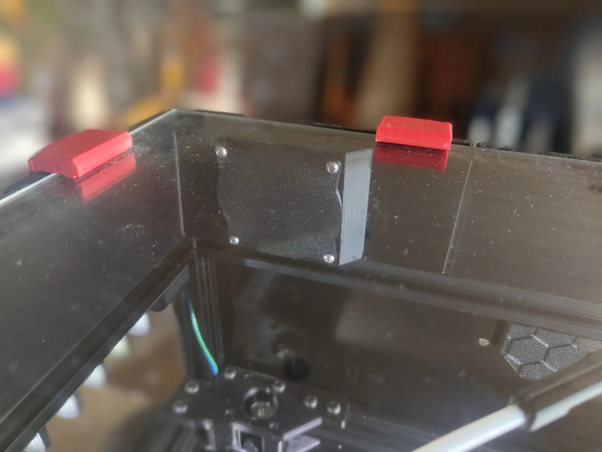
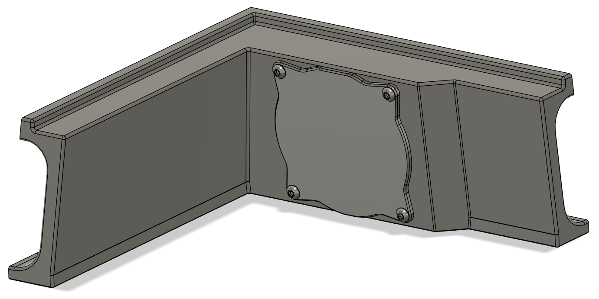

# Canopy fan blockoff plates
### CHANGELOG
- 30.03.2024: Initial release.

### Description:
- I didn't want to re-print the rear corners of  ["JSmith17's Canopy"](https://www.printables.com/model/568090-voron-24-canopy) in case for when i eventually add exhaust fans, so i made these blockoff plates instead.

### Pictures:

### Printing:
- Default voron settings, correct orientation, no supports needed.

### BOM
- 4x M3x6mm BHCS
- 4x M3x5x4mm Heat sets

### To-do List
- Nothing that i can think of.