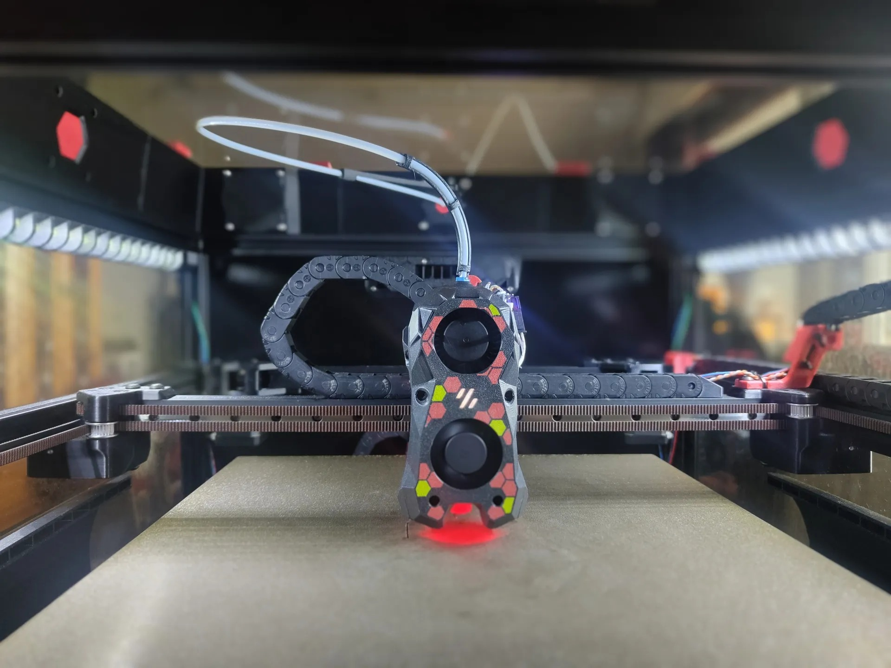
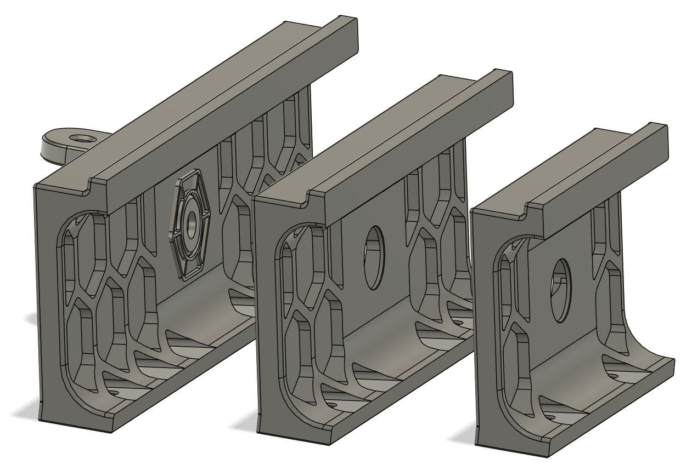
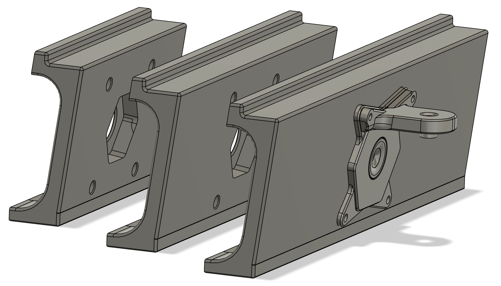
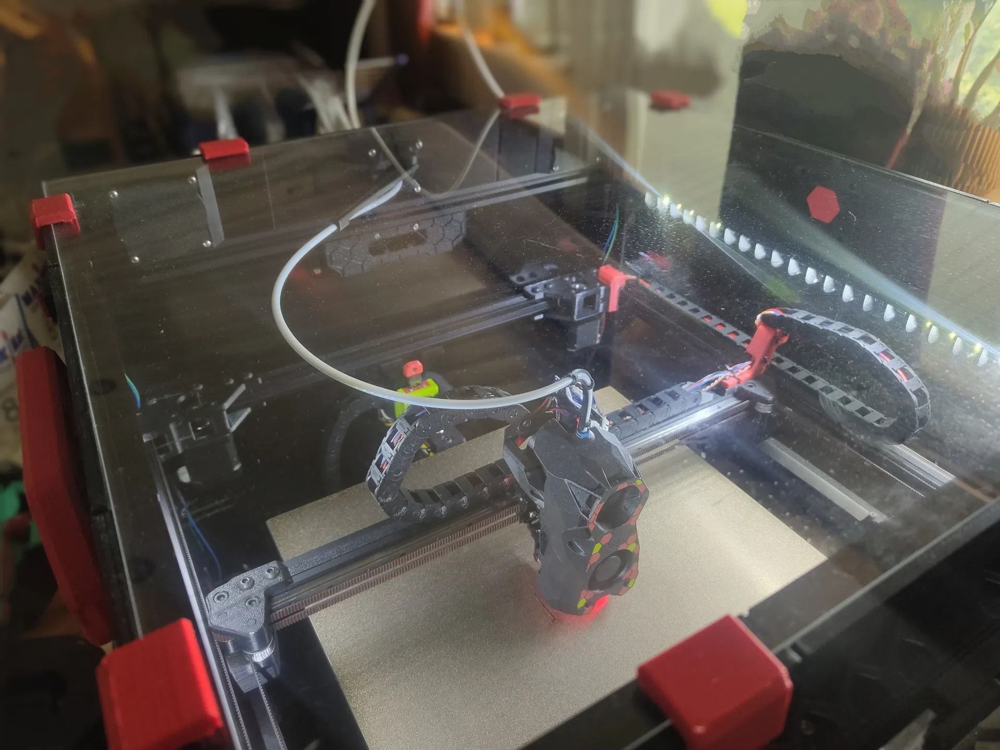

# Canopy PTFE passthrough
### CHANGELOG
- 30.03.2024: Initial release.

### Description:
- I'm running both a Nevermore Stealthmax (which have sub-ideal PTFE routing) and ["JSmith17's Canopy"](https://www.printables.com/model/568090-voron-24-canopy) on my Trident so I thought I'd make a better and more elegant way to route the PTFE-tube.
And this is what it ended up with making, it removes the logo from the rear (or where ever you want your PTFE tube to enter) middle Canopy section and adds a “UM2-style” PTFE connector to it. 
- I've also made a mount for my PTFE-tube support to help guide the tube around (designed with Trident in mind, but works just as good on a 2.4). For a Trident you also need to use the Trident PTFE Guides to help steer the tube neatly (for me the “R50-90°”  works best).

### Pictures:

### Printing:
- Default voron settings, correct orientation.
- Supports needed on the Canopy part, refere to the "Canopy sides" description from my ["Canopy side handles mod"](https://github.com/Exerqtor/Voron/tree/main/Mods/350mm_canopy_side_handles).

### Bom:

**Without guide:**

- 4x M3x6mm BHCS
- 4x M3x5x4mm Heat sets
- 1x "UM2-style" PTFE connector

**With PTFE guide:**

- 2x M3x6mm BHCS
- 2x M3x8mm BHCS
- 4x M3x5x4mm Heat sets
- 1x M5x10mm BHCS
- 1x MR85 bearing
- 1x "UM2-style" PTFE connector

### To-do List
- Nothing that i can think of.