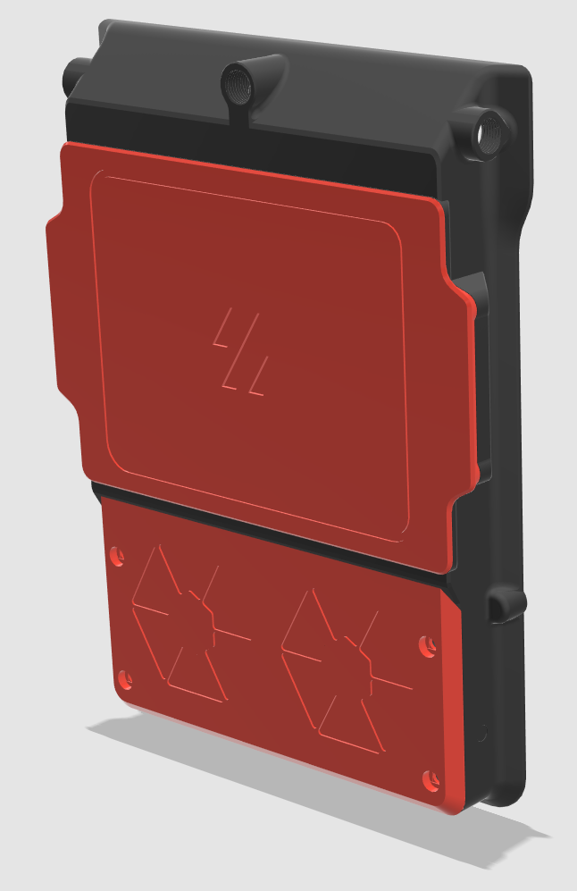
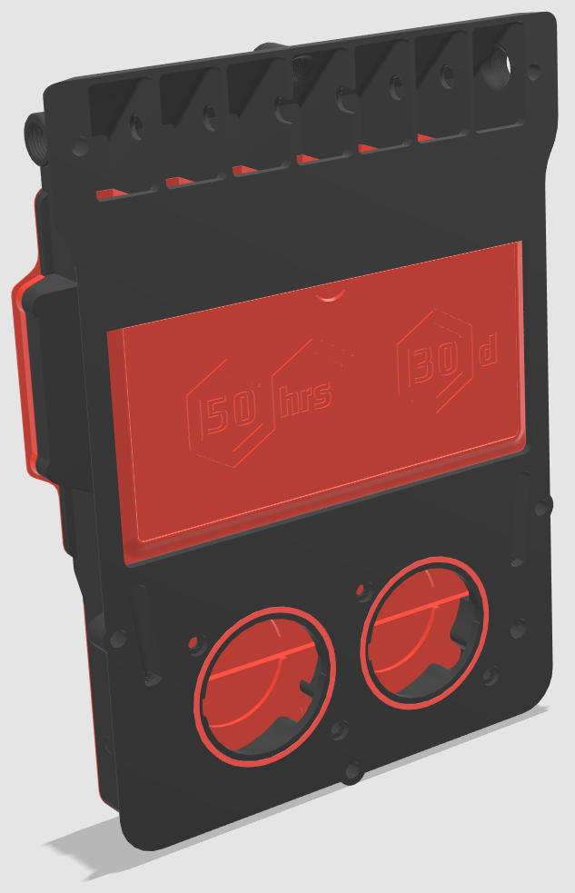
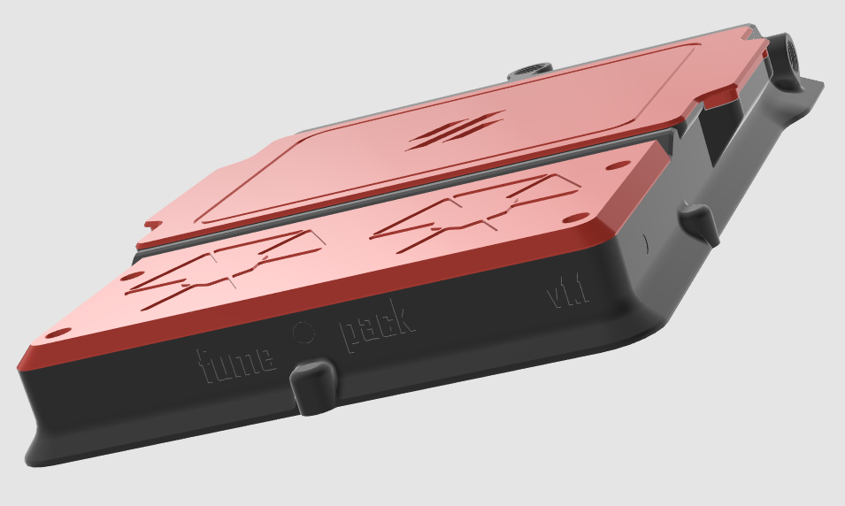
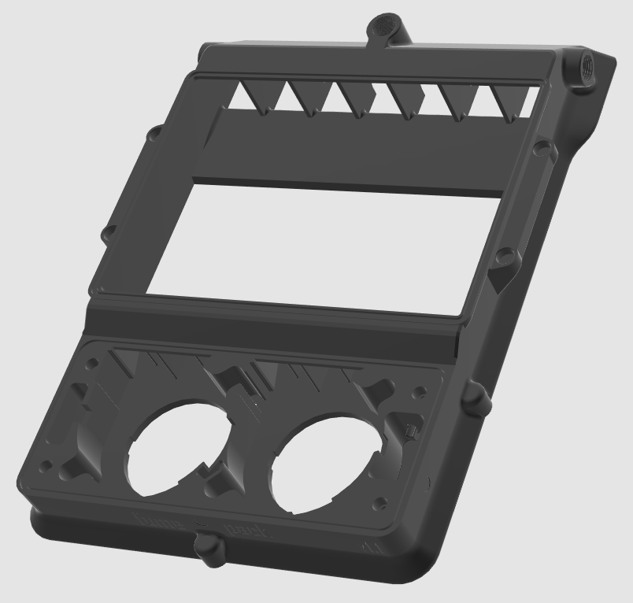
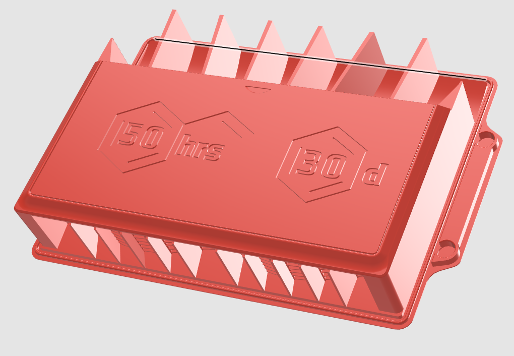
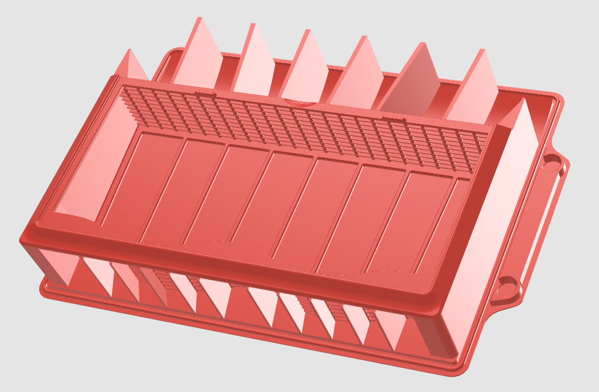
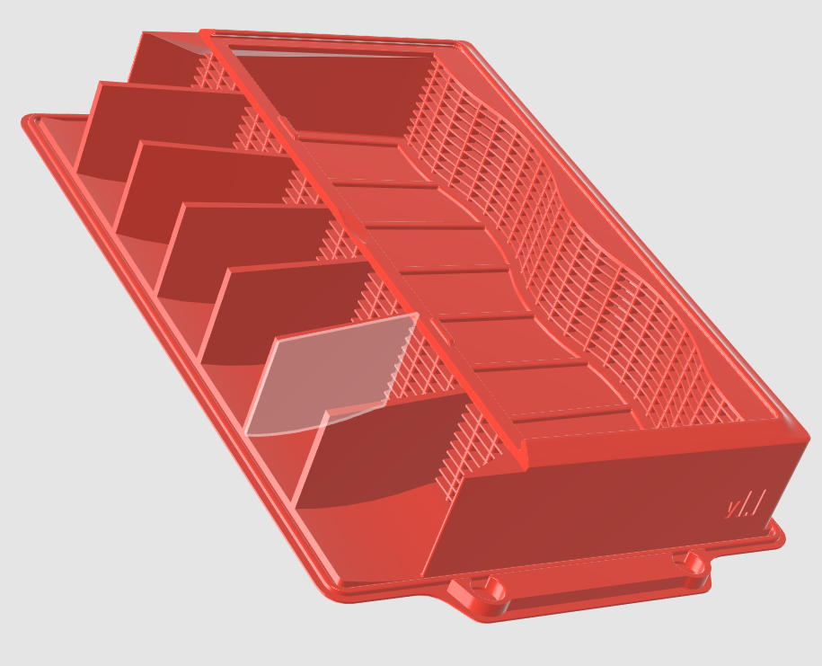
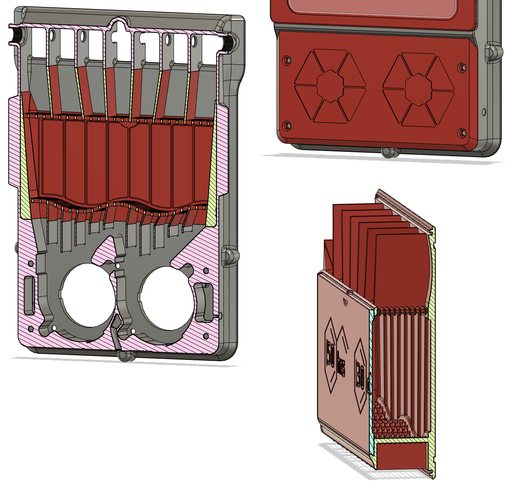
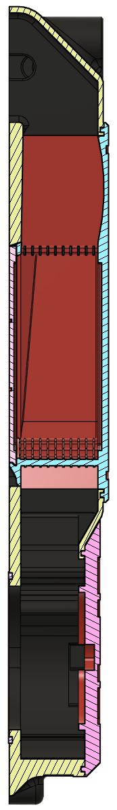

# fume pack

## CHANGELOG
- 01.12.2022: Initial release, refere to description..

###### Description:
Since the "fume pack" is directly dervied from ["Pepe pack v2.2"](https://github.com/Exerqtor/Voron/tree/main/Mods/pepe_pack_v2) I will only mention the changes done from that point and forrward:
- Ground-up rework of the carbon container/cartridge/basket (what ever you eant to call it) to closer resemble the Nevermore Micro V5 Duo.  In other words should "fume pack" do the job exactly like a stock V5 Duo, if not better since the basket has a somewhat larger surface area of carbon for the air to pass thru.
- With the new cartridge the carbon abmount is roughly cut in two compared to "pepe pack" and now pretty much the same as aevermore Micro V5 Duo.
- Redesign of the fan lid, with deeper holes in the main body to accept 8mm bolts.

# It shouldn't need to be mentioned, BUT before someone tears me a new one for "being at fault for them fucking up their back panel with to many holes": MAKE SURE YOU DRILL ONLY THE HOLES NEEDED FOR YOUR PARTICULAR APPLICATION!!

- If you choose to use the fan gaskets or not is totally up to you, i don't think they have THAT much of an effect but hey. Just for gods sake print them in a soft TPU, nothing "solid".
- Same goes for bolting down the fans, the fan lid is designed to firmly hold the fans in place. But how well that works depends on your fans!

I want to point out that the fans need to be cut up to work as intended(for those who didn't know). 
- [This is how the fans is supposed to look after cutting](https://raw.githubusercontent.com/Exerqtor/Voron/main/Mods/fume_pack/pics/fancut1.png). 

Regarding cutting the fans i will try to either make a little guide, or at least a cuting guide so you can mark of where to cut them correctly.

## And finally, choose the main body who suits your needs the best, both "5-bolt" and "13-bolt" version have three variants with PTFE holes either on all three sides, both sides OR rear only (like stock Voron) 

And as allways, if you have any ideas for new features or improvement give me a ding!

###### Pictures:

###### Bom:
13-Bolt:
- 11x M3x8mm BHCS (or SHCS)  - To mount the main body to the back panel (re-use the stock exhaust grill screws).
- 4x M3x8mm BHCS  - To mount the fans to the main body (optional).
- 13x M3x5x4mm Heat sets - To mount the main body to the back panel.
- 4x M3x5x4mm Heat sets - To mount the fans to the main body (optional).
- 8x 6x3mm Magnets (N35 works, but N52 is the best way to go) - to hold the basket on to the main body.

5-Bolt
- 3x M3x8mm BHCS (or SHCS)  - To mount the main body to the back panel (re-use the stock exhaust grill screws).
- 4x M3x8mm BHCS  - To mount the fans to the main body (optional).
- 5x M3x5x4mm Heat sets - To mount the main body to the back panel.
- 4x M3x5x4mm Heat sets - To mount the fans to the main body (optional).
- 8x 6x3mm Magnets (N35 works, but N52 is the best way to go) - to hold the basket on to the main body.

###### Printing:
- Default voron settings, correct orientation, no supports needed!

###### To-do List
- Make a better readme / instructions.
- Different cartridges with HEPA filters, echaust feature etc. time will show.
- MAYBE a simple filament runnout sensor attachment.

##### Credits:
- [Pepe pack v2's](https://github.com/Exerqtor/Voron/tree/main/Mods/pepe_pack_v2) predecessor,  `smooshworx`'s mod called ["pepe-pack"](https://github.com/smooshworx/pepe-pack) and it's CAD. Pepe pack is based on `thiagolocatelli`'s ["Funny Pack"](https://github.com/3DPrintingMods/Voron/tree/master/Mods/funny_pack). Fanny Pack is then again based on `oab1`'s ["FannyPack"](https://github.com/oab1/VoronMods/tree/main/v2.2%20Recirculating%20Filter)
- The ["Nevermore Micro V5 Duo,"](https://github.com/nevermore3d/Nevermore_Micro), who the fume pack is heavily moved back to when it comes to specifically the cartridge design. 