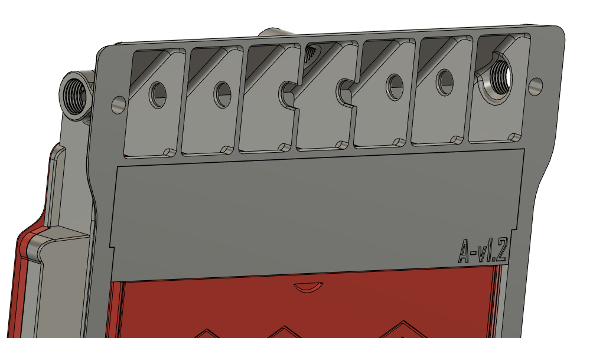
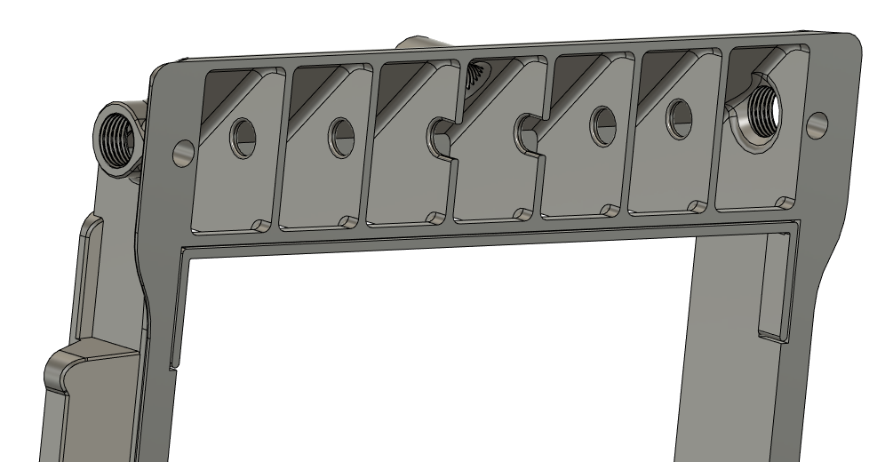
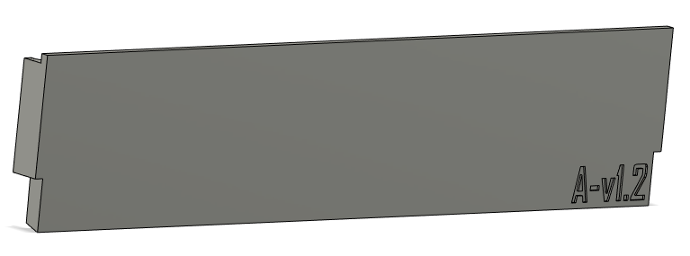
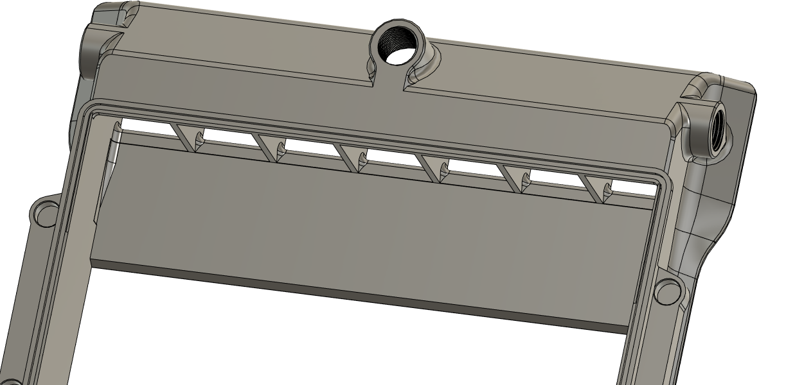
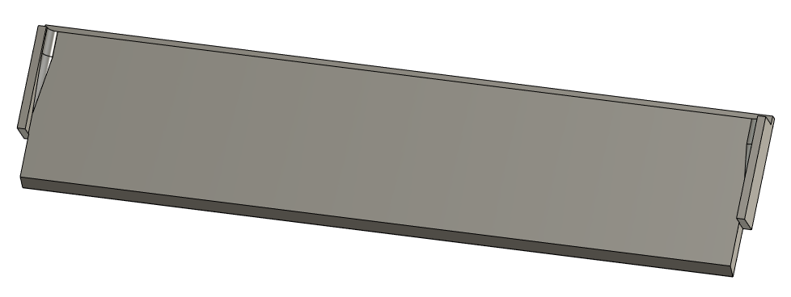
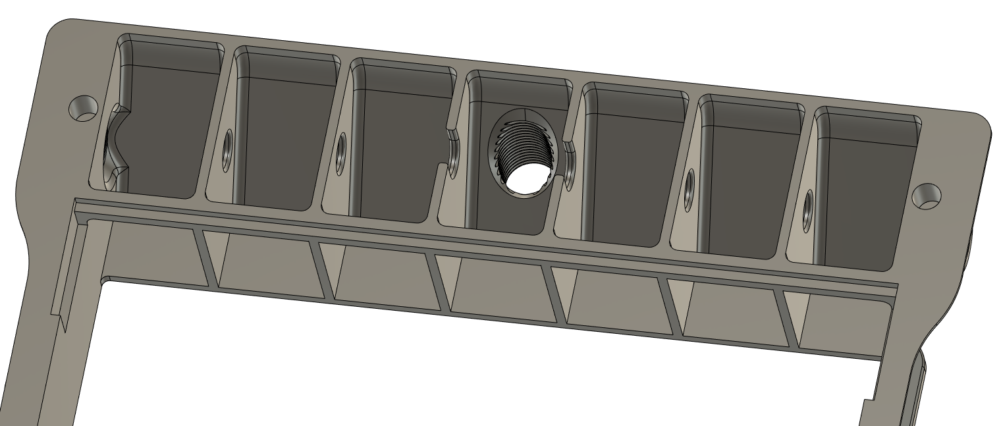

# fume pack

## CHANGELOG v1.2
- 03.12.2022: Version 1.2: to have some more flexibility in regards of different cartridges I've made the "plate" on the main body bellow the exhaust vent a loose peace.
Future releases might call for the plate to be swaped out infavor of a new design, but that's way better than having to reprint the whole main housing.
It's got built in supports for the overhanging parts in the main body so it shouldn't be any problem printing this, if you run into some issues, please let me know ASAP!   

###### Pictures:

