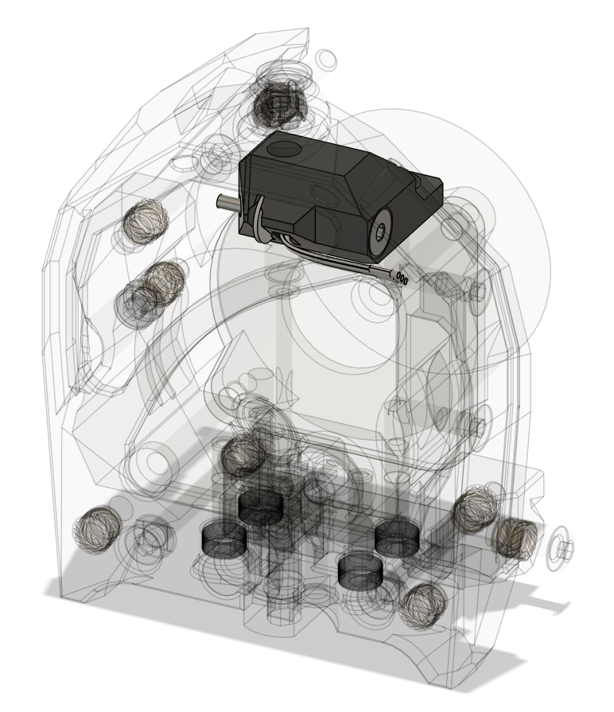
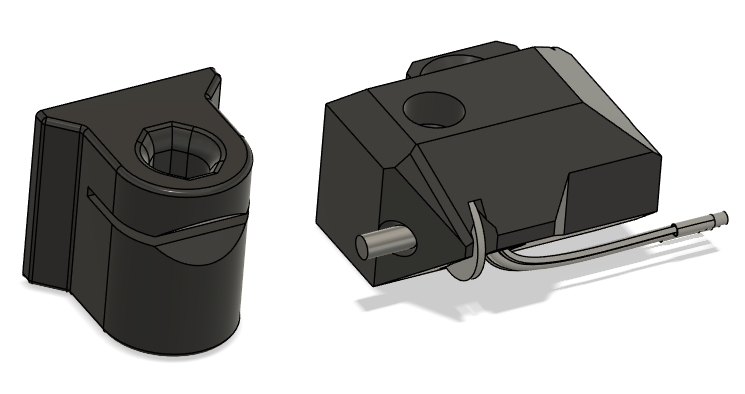
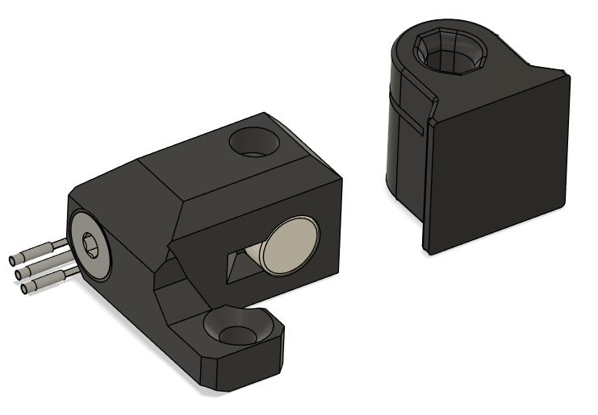
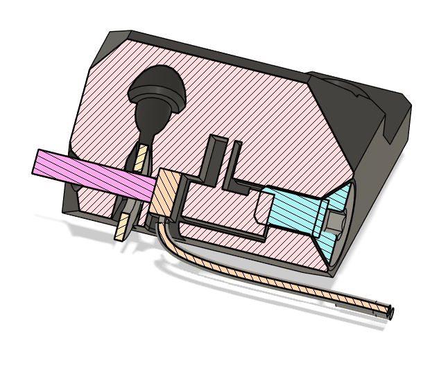

# Filament runout sensor for Bondtech LGX lite (v1 & v2)

## CHANGELOG
- 17.02.2025: Initial release.

###### Printing:
- Default voron settings, correct orientation, no supports needed!

###### Bom:
- 2x 6mm FHCS - Needs to be stainless to avoid interference with the HALL sensor.
- 1x 3mm DIN washer - Needs to be steel to interact properly with the HALL sensor.
- 1x AH3364Q-P-B hall sensor - "Name brand" one from a reputable vendor  is adviced (but not a must).
- 1x 6x3mm magnet - Both N35 & N52 does the job, but N52 works the best.

###### Description:
- Initial design by Olof at Bondtech, and we've been collaborating to get it to it's current form. 
I've been testing different iderations of this for well over a year at this point and it's been working like a champ.
- The Sensor is meant to mount above the LGX Lite, inside Bondtechs mount (my MMU & Filametrix mounts are based of Bondtecs mounts so it naturally fits there too).

### !!ATTENTION!! This sensor does NOT work with the LGX Lite PRO, I have one in the works. But since i haven't got a LGX Lite PRO to test with this isn't getting prioritized. 

###### Assembly instructions:
- Prep the printed part by making sure any strings, blobs etc. is removed.
- Get the FHCS screw started about 2mm. into the side of the sensor body.
- Insert AH3364Q-P-B in it's slot.
  - If needed use a exacto knife to remove any print debris from the hall sensor slot so that it seats fully.
- Tighten down the screw while making sure the AH3364Q-P-B is still seated properly in the sensor housing.
- Insert the magnet and then the washer in their locations.
  - If the magnet feels a little loose when you put it in it's better to add a tiny drop of CA-glue or nail polish to secure it.
- Snip off a stump of 1.75mm filament and insert it into the hole in the side of the sensor body to retain the washer (and trim it to size, but leave enough that you can still use some pliers to remove it).
- Do a bench test with some filament and check that it can pass through the sensor without any issues.
- If you haven't done so allready you should now solder on some wires to the hall sensor before you bend the pins flush to the sensor body (like shown in the renders).
- Cut a piece of PTFE with the jig and insert it to the top/filament entrence of your LGX-lite.
- Mount the filament sensor with a the remaining 6mm FHCS (both 6mm and 8mm should work fine for this).

- I'm not gonna go into how you're supposed to solder, wire up & configure the HALL sensor for your machine but there’s more than enough information on the internet for you to figgure that out yourself ;)  

###### Pictures:

###### To-do List
- Nothing that i can think of.

##### Credits:
- Olof Ogland
- [ERCF project](https://github.com/Enraged-Rabbit-Community/ERCF_v2) for much of the sensor geometry.