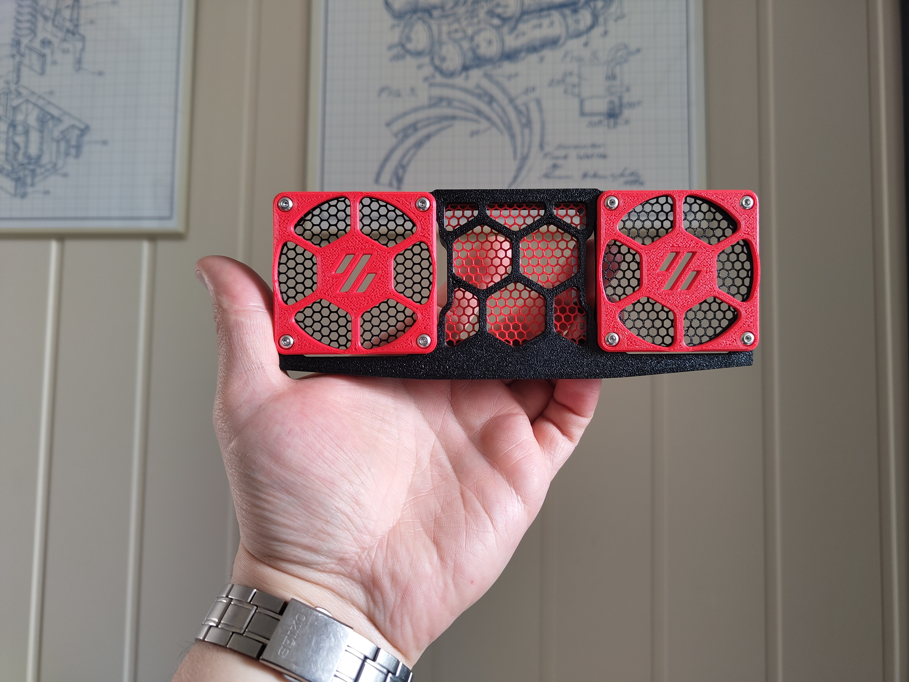
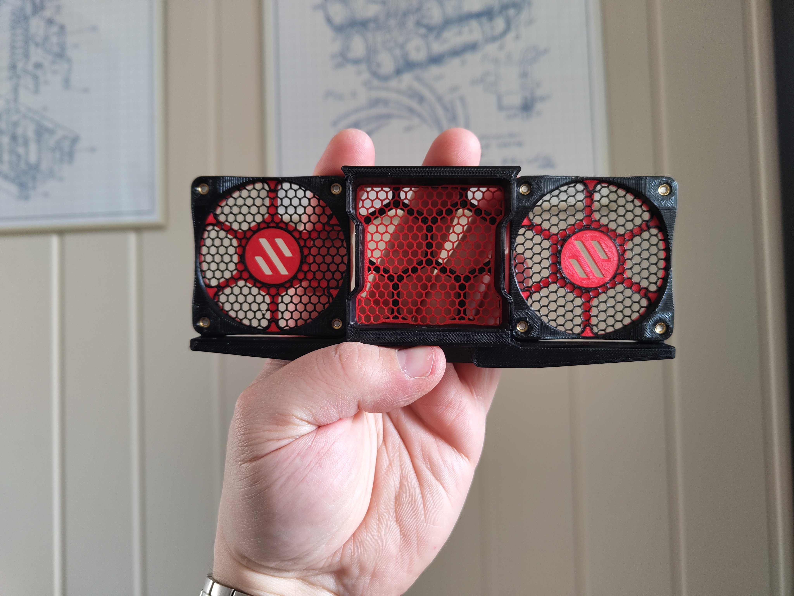
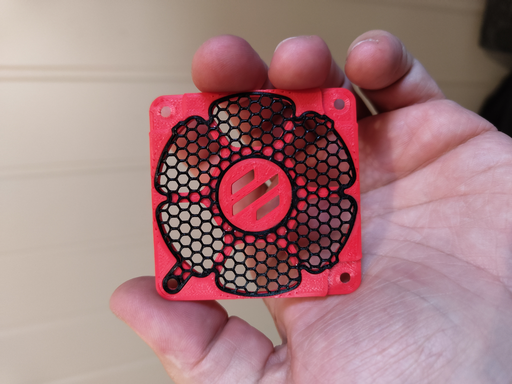

# Middle Fan Support with mesh

## CHANGELOG
- 12.04.2023: Initial release.

###### Description:
Couldn't find any "clean" mods for adding mesh to the middle fan support, so i made this.
- The mesh parts are made to snap in, but i added a tiny drop of CA-glue on the backside in some spots to make sure they stay in place.
- Print the mesh with 0 bottom/top layers, 2 perimeters & 20% honeycomb infill. You will most likely need to tweak the infill angle to make the "points" of the hexagons point upwards (usually 0 or 90 degrees). (I also found that the side printed downwards/towards the texuted PEI gave the best look on the fan mesh/black).

- [For a reference to how to do the mesh part look at Eddies clip from 6:20](https://www.youtube.com/watch?v=K6sHfXldK4k&t=380s). 

###### Pictures:

###### Printing:
- Default voron settings, no additional supports needed (other than the build in ones)!

###### To-do List
- Make a better readme / instructions.