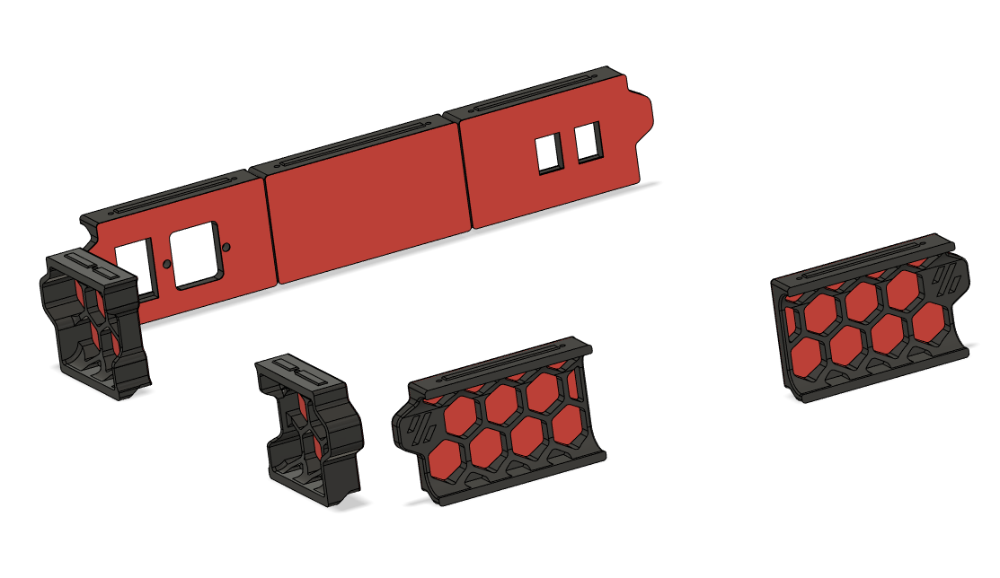

# Trident r1 Skirts with mesh

## CHANGELOG
- 16.04.2023: [I found a fault in the official CAD & .stl. Fixed in this update, refere to the issue I made.](https://github.com/VoronDesign/Voron-Trident/issues/117)
- 16.04.2023: Initial release.

###### Description:
- Full set of meshed skirts for Trident r1.

- [Regarding the middle fans you can use this.](https://github.com/Exerqtor/Voron/tree/main/Mods/mesh_skirts/Middle_Fan_Support)

# !!Caution!!
## - The two "parts" of each skirt segment are meant to be printed TOGETHER!
## - [For a reference to how this works, take a  look at Eddies video from  about 4:54.](https://www.youtube.com/watch?v=K6sHfXldK4k&t=294s)

## - I've had some issues with the second/top-part not printing to nicely to the "meshed" first/llower-part if i run on my stock print & cooling settings, so to mitigate this I inserted some extra code (in my slicer) at the start and end of layer 4 (the first layer of the second/top-part start):
__Layer 4 start:__
```
M220 S50    ; Speed factor override percentage
```
__Layer 5 start:__
```
M220 S100    ; Speed factor override percentage
```

I've also set my filmaent cooling `Disable fan for the first X layers` to `4` so that the part cooling don't start up before the second/top-part has it's first layer put down.

###### Pictures:


###### Printing:
- Default voron settings, no additional supports needed (other than the build in ones)!

###### To-do List
- Make a better readme / instructions.