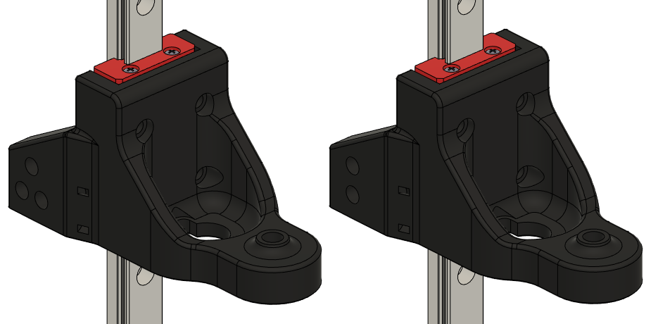
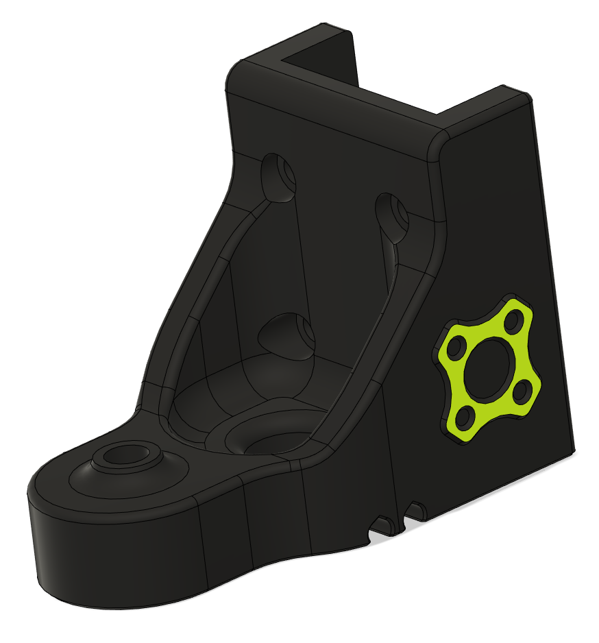

# MGN12H rear Z carrier for Trident
## CHANGELOG
- 01.05.2023: Opened up the center hole (where the leadscrew goes through) too 13mm to allow for more leadscrew movement wiithout interfering witht he carrier body.
- 25.04.2023: Variable pin sizes for WobbleX carriers, since it's been some issues with the pin sizes being either too small or large I've made a little test model so you can determine what suits you best. When you've found the right size for you then you choose the corresponding set of carriers & TR8 adapters.
- 15.04.2023: WobbleX v1.7, resized the pin holes too 2.9mm (the old/stock was 3.1mm and the pins would be loose and fall out).
- 15.04.2023: WobbleX v1.6, added recess for the WobbleX balls (missing in stock/MGN9H release too).
- 11.04.2023: Counterbore fix for all carriages & WobbleX v1.5.
- 11.04.2023: WobbleX v1.
- 30.11.2022: Initial release.

###### Printing:
- Default voron settings, correct orientation, no supports needed!

###### Bom:
For "standard" carriers:
- Same as stock Trident except a MGN12H rail set.
For WobbleX carriers:
- 1x WobbleX WS8
- Stock Voron Trident screws etc.

###### Description:
- Modifed Voron Triden r1 rear Z carrier to house a MGN12H block instead of MGN9H.
- One version for IGUS chains (2bolt), and one version for the generic Chinese ones (3bolt).
- Rail stop that's been sized to accommodate for a MGN12 rail.
- [WobbleX](https://github.com/MirageC79/Interfaces-for-WobbleX-integration/tree/main/Voron/Trident) implementation. 

You will loose a tiny bit of Z travel, otherwise it's not much to "negative" (quite substantial loss of Z travel with WobbleX, but that's not isolated to this mod, it's just the nature of the beast). 

###### Pictures:

10.5mm(old) vs 13mm(new)

###### To-do List
- Nothing that i can think of.
