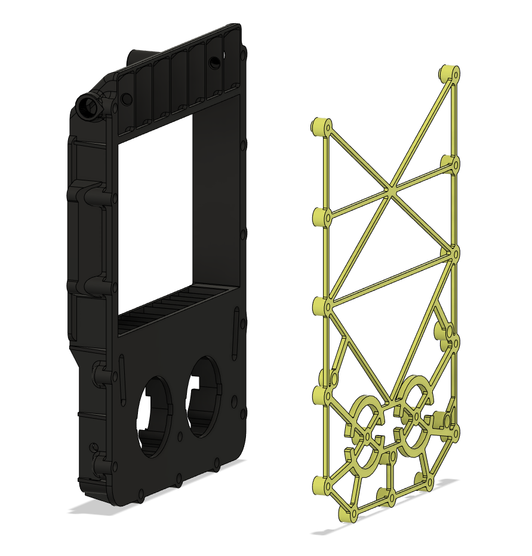

# UPDATE
- 07.08.2022: Initial release, mostly so that smooshworx can have a look at the cad.

## Pepe Pack "v2.1"
##### Credits:
- smooshworx here on gitub made a ["mod of the fanny/funny pack,"](https://github.com/smooshworx/pepe-pack), and i've done some further work on it together with him.

###### Printing:
- Default voron settings, correct orientation, no supports needed!

###### Bom:
- 15x M3x8mm BHCS - if you choose to use all the mounting points!
- 15x M3x5x4mm Heat sets - if you choose to use all the mounting points!
- 8x 6x3mm Magnets - to hold the basket

###### Description:
- Added two new cable chanels that tuck in right under the rear extrusion on a Trident..
- Totally re-worked the drill template so that it's more printer and OCD friendly, with the added holes for those who want to use "my" cable channels.
- Added side entry PTFE coupling points.
- Fixed some issues with the CAD for the main housing.

###### Pictures:

###### To-do List
- Add the re-worked carbon baskets as soon as they get released by smooshworx.
