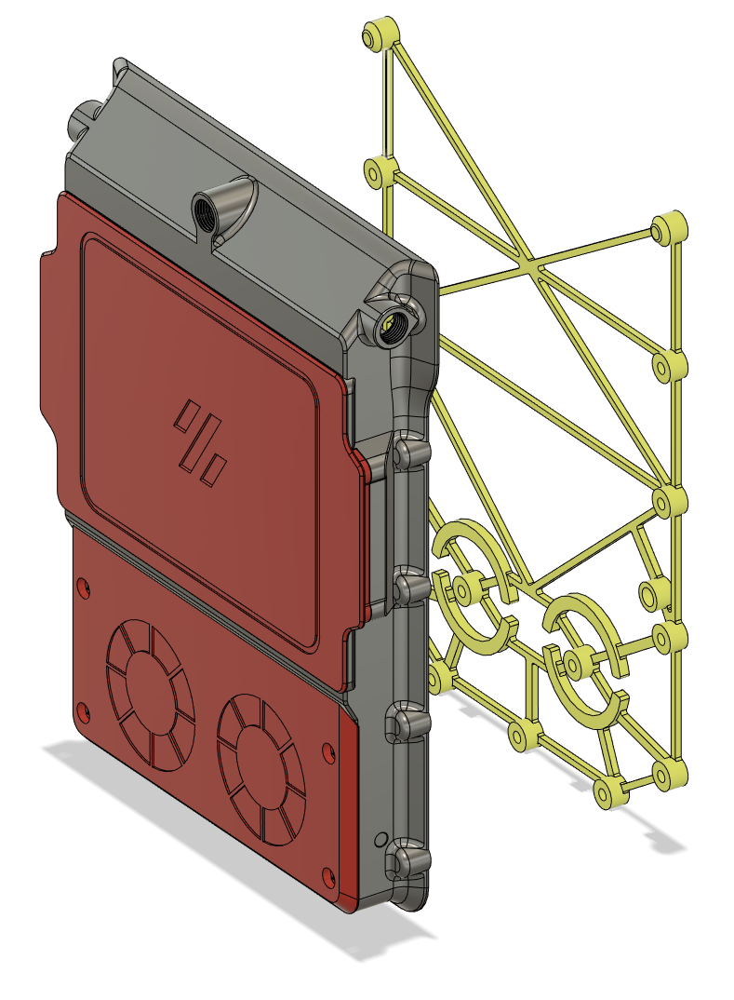
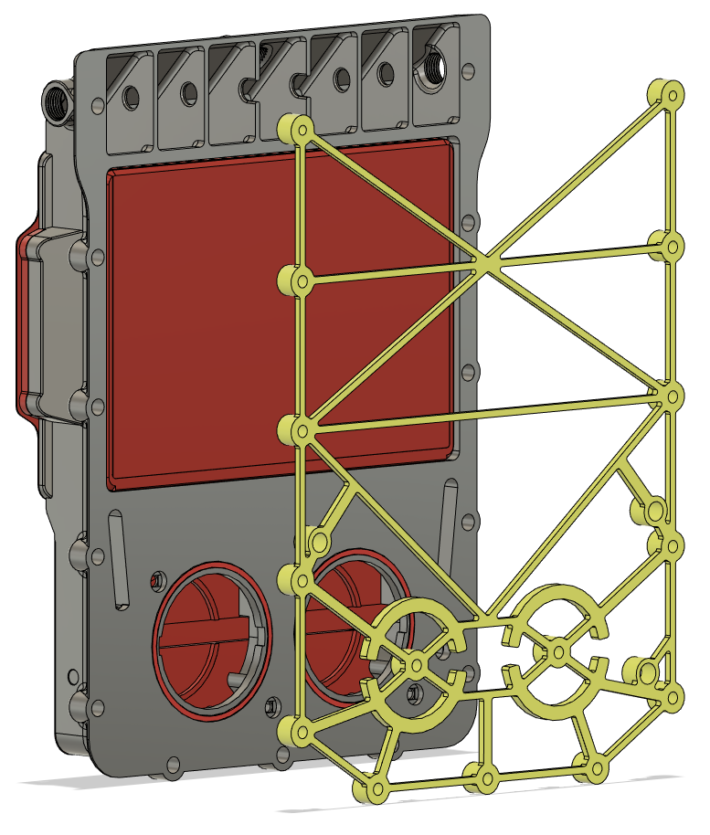
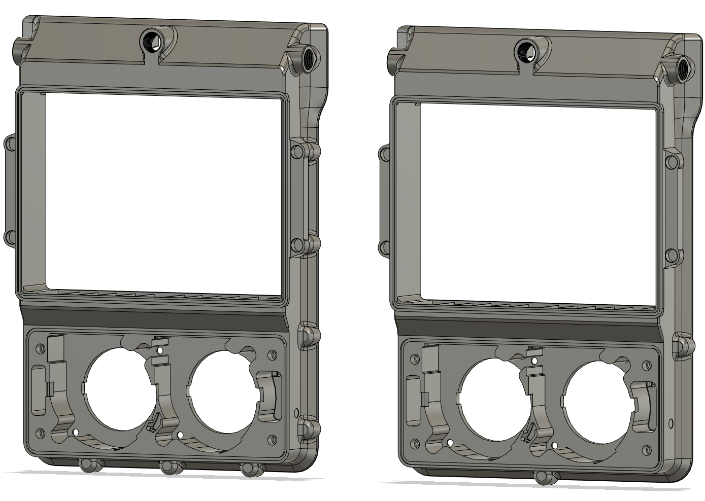
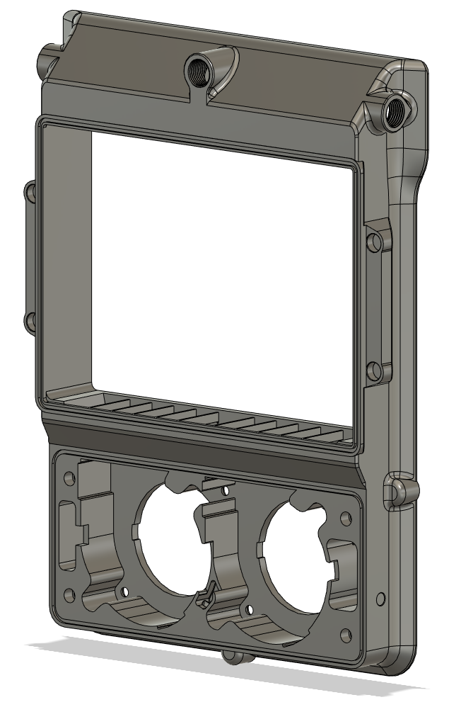
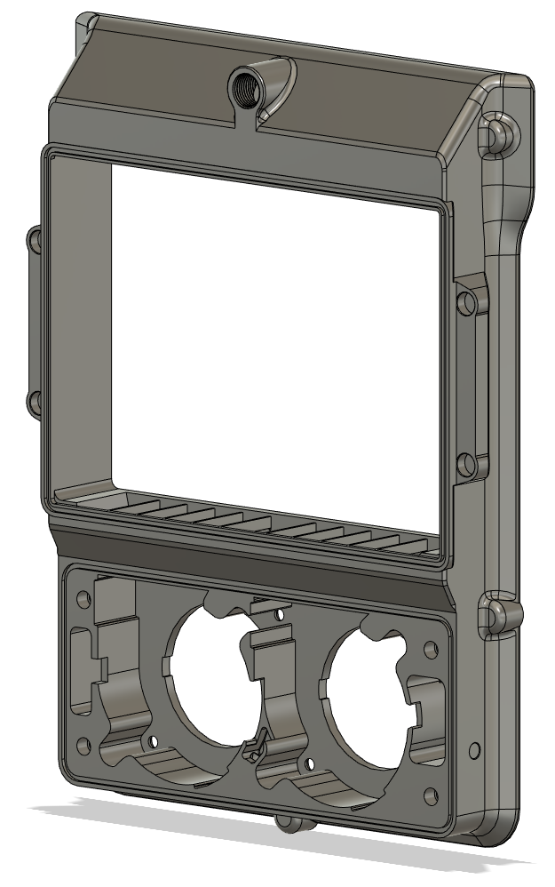

# Pepe Pack v2

## CHANGELOG
- 01.12.2022: One last little update, made the holes in the main bodies that the fan lid screw into a little deeper. So now they also use M3x8 BHCS botls. 
- As of November 28th 2022, this mod will not recieve further updates. An all new version will be released called "fume pack" (yeah really nailed the name right ?lol)
- 28.11.2022: v2.2 realease - Rather extensive rework of the basket, made a 5-bolt version, added gaskets for the fan intakes, cleaning up model+++ (read description for a more complete list).
- 07.08.2022: Initial release, mostly so that smooshworx can have a look at the cad.

###### Description:
Main changes from it's [predecessors](https://github.com/Exerqtor/Voron/tree/main/Mods/pepe_pack_v2#credits) and new features is the following:
- Added two new cable chanels that tuck in right under the rear extrusion on a Trident..
- Totally re-worked the drill template so that it's more printer and OCD friendly, with the added holes for those who want to use "my" cable channels.
- Added side entry PTFE coupling points.
- Fixed some issues with the CAD for the main housing.
- Added gaskets around the fan inlets (optional).
- Extensive rework of the basket grills, and some tweaking to the basket lid.
- Added holes to screw the fans down to the main body.
- Added "Prusa-style" overhangs for bolt mounts.
- Added a "5-bolt" version, removing (objectively) unneeded mounting bolts.
- Removed the "gussets" on the outside of the main body.
- Altered the fillets and chamfers on main body to fit the Voron design aestetic somewhat better (imo).
- Added some "lips" to the main body to better cover up the hole in the back panel (somewhat like the original exhaust housing).
- "Blocked" off all external wire passages with a cutaway piece and reworked the channeling for the wires.
- Widened the "fins" above the fans to make them more printable.
- Adjusted the hole size for the magnets so they don't fall out.
- Lots of small stuff i've forgot by now.

###### Pictures:

###### Bom:
- 15x M3x8mm BHCS - if you choose to use all the mounting points!
- 15x M3x5x4mm Heat sets - if you choose to use all the mounting points!
- 8x 6x3mm Magnets - to hold the basket

###### Printing:
- Default voron settings, correct orientation, no supports needed!

###### To-do List
- Nothing more to do here, finish up "fume pack" and get it released next.

##### Credits:
-  `smooshworx`'s mod called ["pepe-pack"](https://github.com/smooshworx/pepe-pack) and it's CAD. Pepe pack is based on `thiagolocatelli`'s ["Funny Pack"](https://github.com/3DPrintingMods/Voron/tree/master/Mods/funny_pack). Fanny Pack is then again based on `oab1`'s ["FannyPack"](https://github.com/oab1/VoronMods/tree/main/v2.2%20Recirculating%20Filter)