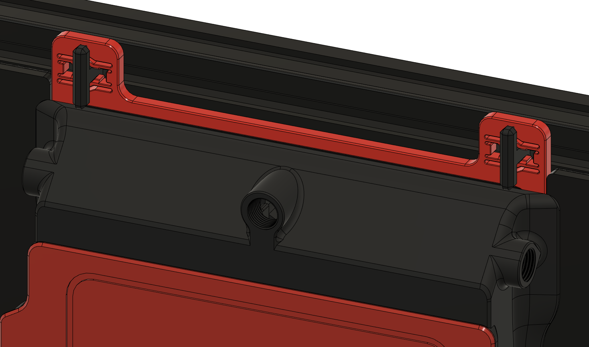
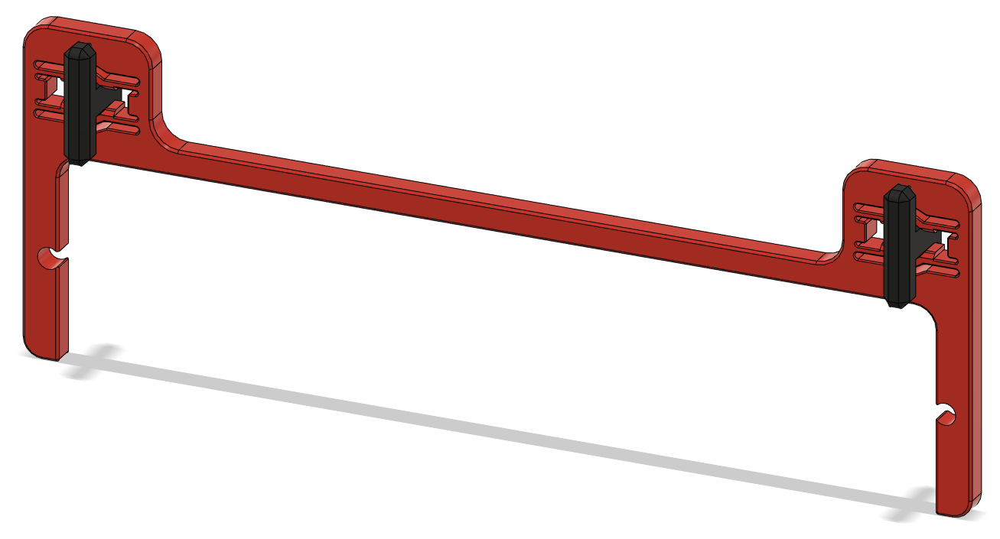

# CHANGELOG
- 29.11.2022: Initial release.

## Quick realease exhaust assembly mounts
##### Credits:
- Annex-Engineering for sharing the CAD for there  ["2020_Clips_and_Hinges"](https://github.com/Annex-Engineering/Other_Printer_Mods/tree/master/All_Printers/Annex_Panel_2020_Clips_and_Hinges),.

###### Printing:
- Default voron settings, correct orientation, no supports needed!

###### Bom:
- Only printed parts.

###### Description:
- Added "Annex-Engineering styled" quick release to the exhaust filter assembly mounts.
- Combined the two exhaust mounts since these are "locked in" by the hole spacing on the exhaust housing anyways.

Meant to be used with a 3mm panel and 1mm foam tape.

###### Pictures:

###### To-do List
- Nothing that i can think of.
