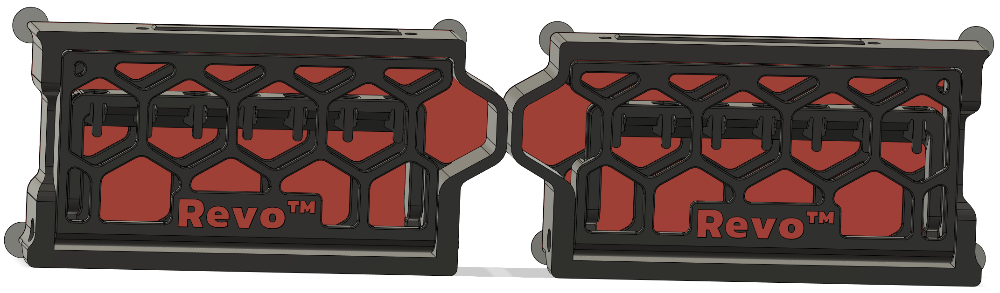
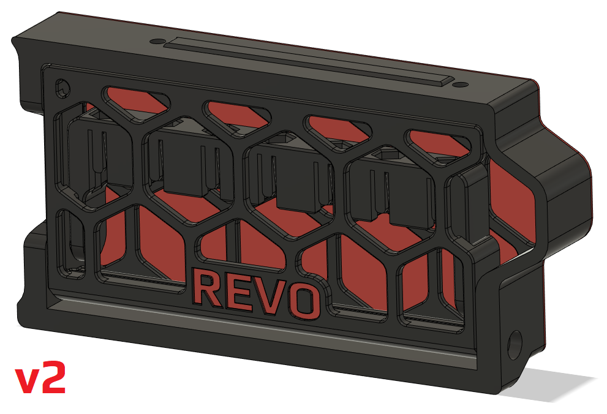
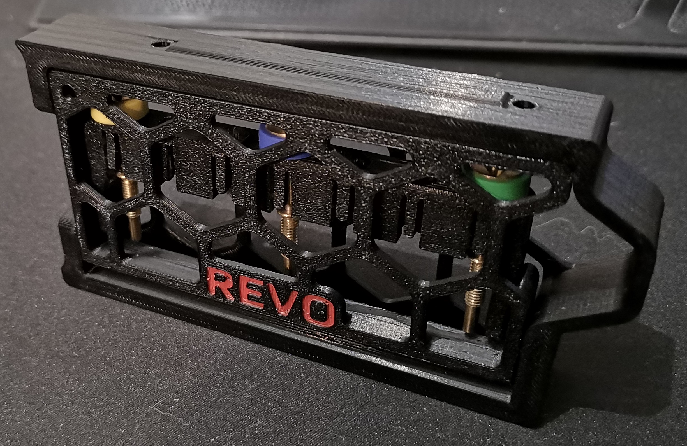
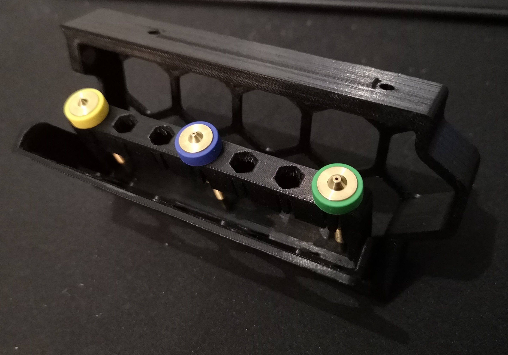

# CHANGELOG
- 25.06.2023:  A&B "sides" tolerance tweaking and new "Revo logo" plus renaming. I never realy liked the font and look of the "REVO" text on the lid, so i've now changed font to the same E3D use in much of their revo marketing. I also changed the text to  "Revo™". 
I've also made a A & B side now. So now we can stock up 28 nozzels on our Tridents if we so wish! Almost forgot to mention it, but i've also redone the nozzle carrier so it's less clunky AND easier to open. AND for those who want to print the MM/mesh version, I've added brim ears as a separate part since i've experienced issues with the tips warping during filamentchanges.
- 20.04.2023: Did a brainfart when i exported the MM lid, and didn't select all the parts to export as one .stl. now that's fixed.
- 18.04.2023: v2, This is the first of a "rewamp" of this mod, cleaned up the cad, added the option for meshed backing, adjusted some clearances. More to come!
- 16.07.2022: Initial release, this is NOT the finished or polished "product" but it works! I will update the design and publish the CAD (with updated STL's ofc) as soon as i can!
This is ONLY for the left side on a 350mm Trident!

## Revo nozzle storage skirt
##### Credits:
- Voron Discord channel user Andre#7463 (So I says...), he was the one who made the initial design and supplied the CAD that i worked of for the skirt part.
- Printables.com user Fabian, for his awesome take on retaintng the nozzles on the ["E3D Revo Nozzle Organizer (Bosch Pick & Click)"](https://www.printables.com/model/102698-e3d-revo-nozzle-organizer-bosch-pick-click) 

###### Printing:
- Default voron settings, correct orientation, no supports needed!

###### Bom:
- 2x M3x8 SHCS
- 2x 6x3mm Magnets

###### Description:
- I've been planning to make a solution to store the Revo nozzles on my VT since i joined the pre-order, but hav been putting it off until "So I says..." posted his mod in discord.
When I saw it I finally got the creative juices flowing and jumped right on it. I had allready come across a nice design on Printables for the nozzle retention part that I had planned on
using allready, so I got to work putting this together into something usefull. And well, this is how it ended up. The 350mm variant can store 7 Revo nozzles (only 350mm avalible at the time of writing this).

###### Pictures:

###### To-do List
- Add a "stopper" for the nozzle holder so that it stops in the middle of the opening.
- Add left & rear versions for 350mm.
- Add support for 300mm & 250mm printers.
