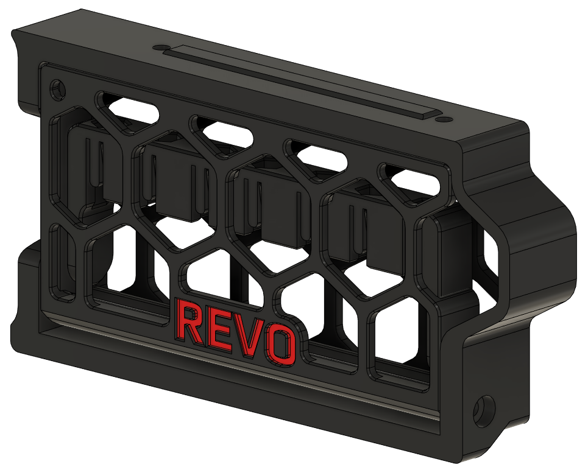

# UPDATE
- 16.07.2022: Initial release, this is NOT the finished or polished "product" but it works! I will update the design and publish the CAD (with updated STL's ofc) as soon as i can!
This is ONLY for the left side on a 350mm Trident!

## Revo nozzle storage skirt
##### Credits:
- Voron Discord channel user Andre#7463 (So I says...), he was the one who made the initial design and supplied the CAD that i worked of for the skirt part.
- Printables.com user Fabian, for his awesome take on retaintng the nozzles on the ["E3D Revo Nozzle Organizer (Bosch Pick & Click)"](https://www.printables.com/model/102698-e3d-revo-nozzle-organizer-bosch-pick-click) 

###### Printing:
- Default voron settings, correct orientation, no supports needed!

###### Bom:
- 2x M3x8 SHCS
- 2x 6x3mm Magnets

###### Description:
- I've been planning to make a solution to store the Revo nozzles on my VT since i joined the pre-order, but hav been putting it off until "So I says..." posted he's take mod in discord.
When i saw his mod I finally got some creative juices flowing and jumped on it. I've allready come across a nice design on Printables for the nozzle retention part that I  had planned on
using allready, so I got to work putting this together into something usefull. And well, this is how it ended up. The 350mm variant can store 7 Revo nozzles (only 350mm avalible at the time of writing this).

###### Pictures:

