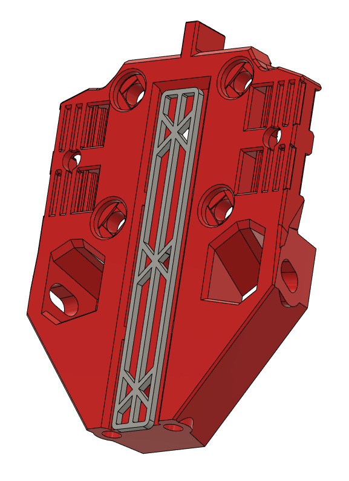
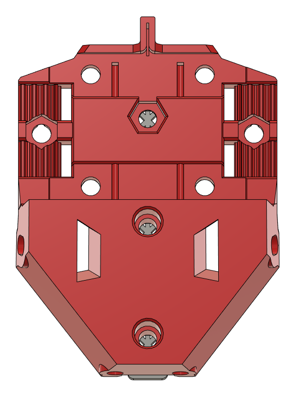
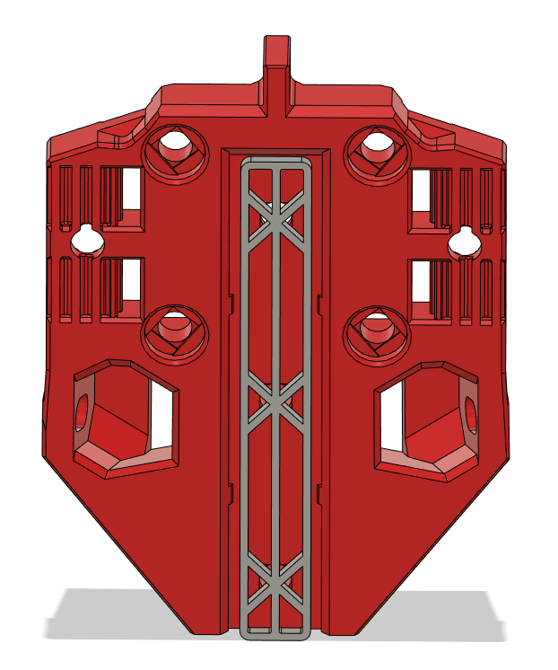

# Sensorless TAP
## CHANGELOG
- 06.05.2023: A sensorless variant of Tap r8. I also took the liberty to fix some bugs/errors in the r8 like: added back the internal rib that were missing, opened up the nut holes for the new belt "clamps" to 5,5mm so the nuts fit beter, added some "meat" where the screw heads tigthen on to for the magnet carriers AND the new rods at the bottom, extended the "rod" holes to 55,3mm so that those who have 55mm bolts can use those, removed some material where the rods pass  under the MGN12 block, redid the "back wall/roof" of the magnet carrier cavity, removed one(technically two) chamfers from the  right magnet carrier cavity + some other minor stuff. So i choose to call this a 

###### Printing:
- Default voron settings, no supports needed!

###### Bom:
- Same as "stock" TAP r8, except you have the opportunity to use 55mm screws as reinforcement rods. 

###### Description:
- Since i'm running my printer sensorless i have no need for the bulge on the right side, hence this mod. 

###### Pictures:

###### To-do List
- Nothing that i can think of.
