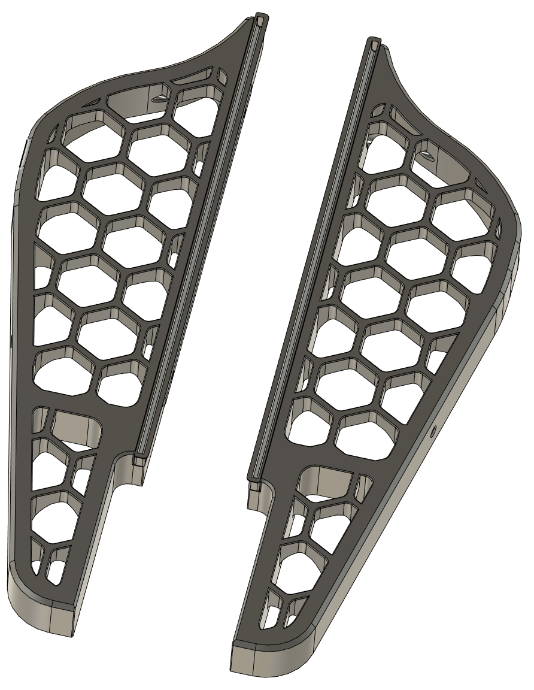

# Voron VT & V2 Service rockers
## CHANGELOG
- 20.04.2023: Tweaked the logo a bit so it's more pronounced and the MM prints better. 
- 18.04.2023: Initial release.

###### Description:
- I've added the posibility to have the voron logos in an accent color, also fixed a couple faults in the design, added some filets/champfers and redesigned the print-in-place support.
- I'm adding both a plane/solid version (no accent colored logo), and one mulit material.

###### Printing:
- Default voron settings (i used adaptive cubic infll @40% to save some print time), correct orientation, no supports needed!

###### Bom:
- 4x M5x8mm BHCS (or SHCS)
- 4x M5 T-slot nuts (T-nut)

###### Pictures:

###### To-do List
- Nothing that i can think of.

##### Credits:
- Based on [Printables.com](https://www.printables.com/) user [Ken226's](https://www.printables.com/@Ken226) model ["Voron Rollback Stands"](https://www.printables.com/model/408015-voron-rollback-stands).