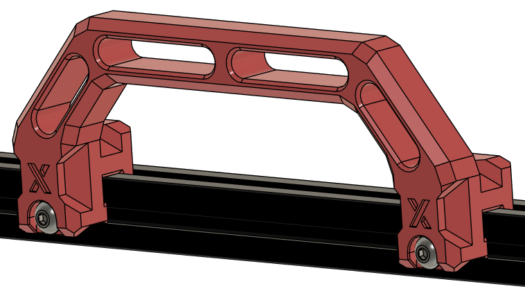
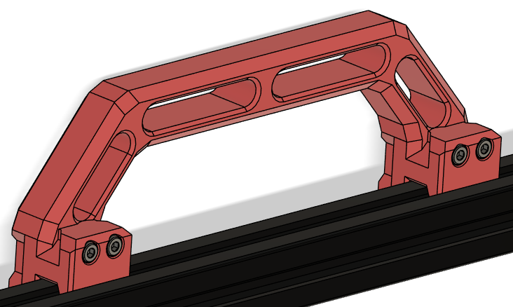
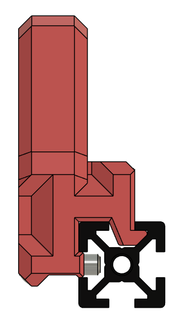
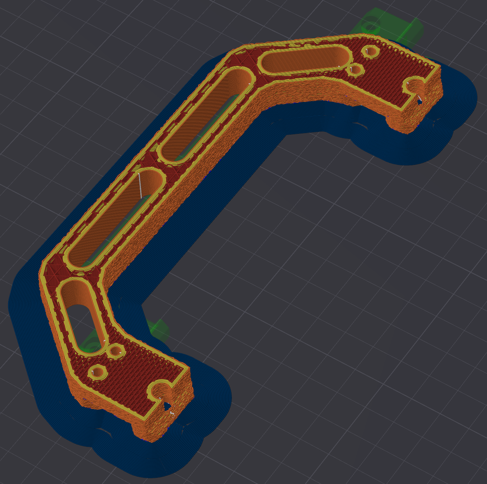

# 2.4 & Trident side handles
### **CHANGELOG:**
- 30.03.2024: Initial release.

### **Description:**
- I've been using the original “Sturdy Handles” before and they've done their job, but then I saw ["JSB's X-Handle"](https://www.printables.com/model/350891-voron-24-x-handle)  and I liked them, but they had some issues with the design. So I ended up doing the following:

- Removed the top mounting bolts in favour of a “lip” that goes into the 2020 extrusion like the original “sturdy handles”
- Added M3x20mm BHCS to mitigate a weak spot in the design where the handle meets the top part, where it "allways" cracked.
- Made modifier blocks to add denser/stronger types of infill around the problem area mentioned above.
- I've also made a second modifier block that makes it possible to add "fuzzy skin" to the handle without compromising the structual integrety while still giving that nice grippy texture (for those who wants it).

*I've also made a version of the handle that's stripped of the “X” since I just don't understand why it's there at all other than nonsensical “branding” (?) , to each their own i guess!*

### **Pictures:**

### **Printing:**
- Default voron settings, correct orientation, no supprts needed!
- First load the handle itself to your slicer.
- Add "Infill.stl" as a modifier to the handle and adjust the infill properties of the modifier.(if you want to add other infill properties to the stress sones).
- Add "Fuzz.stl" as a modifier to the handle and enable fuzzy skin (contour) to the modifier (if you want to add texture to the handle).
If you've gone with both infill and fuzz you will end up with something like this:

This is the sliced view of mine when I use 40% Support Cubic infill on the handle, 40% 3D Honeycomb on the infill modifier & Countor fuzzy skin on the fuzz modifier:

### **BOM (per side):**
- 4x M3x20mm SHCS (for the handle reinforcement)
- 2x M5x16mm  BHCS
- 2x M5 Roll-in T-nuts

###### **To-do List:**
- Nothing that i can think of.