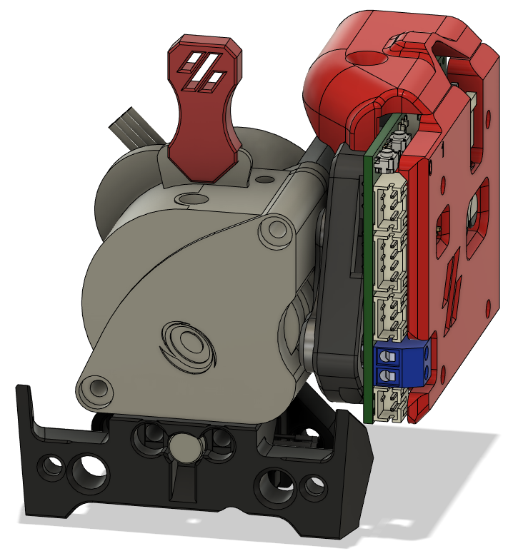
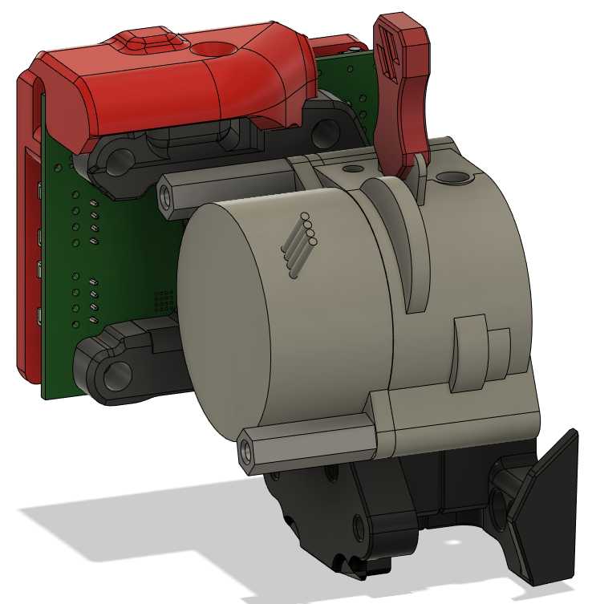
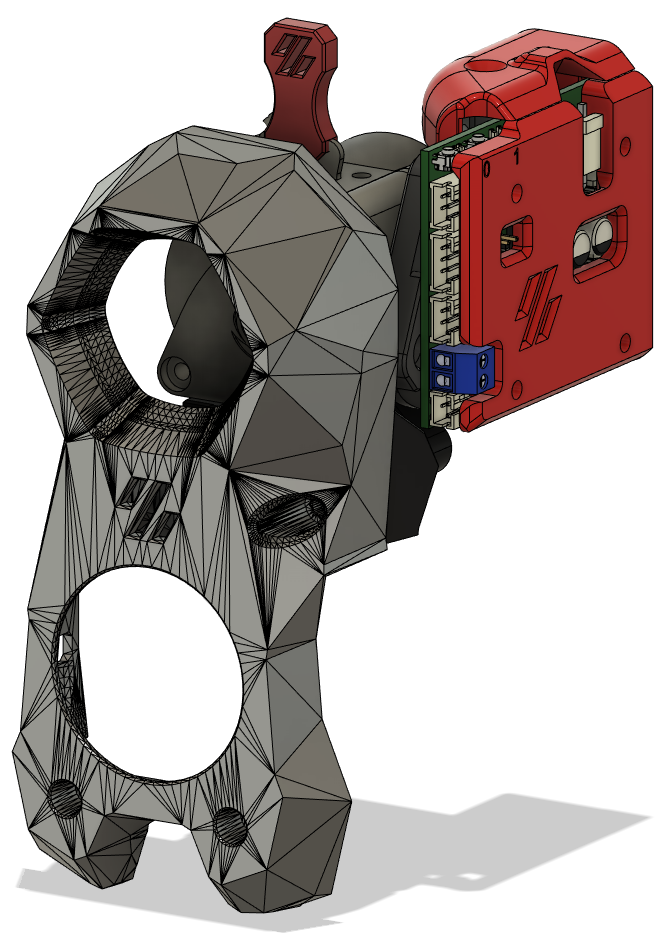

# UPDATE
- 07.08.2022: Initial release, this is based on the Stealthburner beta files, a new one will be made for the RC1 files (or newer, what ever's out when i get time).

## LGX Lite mount for CW2 X carrier and stealthburner
##### Credits:
- Eytecz here on gitub, this is a chopped down version of ["his mod"](https://github.com/Eytecz/LGX_Lite_Stealthburner_CW2_style_mount).

###### Printing:
- Default voron settings, correct orientation, no supports needed!

###### Bom:
- 4x M3x12mm SHCS - for screwing down the LGX Lite to the mount
- 1x AH3364Q-P-B hall effect switch - for the filament sensor
- 1x M3x8mm SHCS - to hold down the hall effect switch
- 1x 6x3mm Magnet - for the filament sensor
- 1x Standard M3 washer(must be magnetic) - for the filament sensor

###### Description:
- I thought the mount Eytecz had made was too big and clunky, so i decided to shave it down and expose the LGX Lite without having the "cocoon".
- This also works with my Duet3D 1LC v1.2 mount!

###### Pictures:

Paired with my 1LC mount

###### To-do List
- Update it "work" with the Stealthburner RC1.