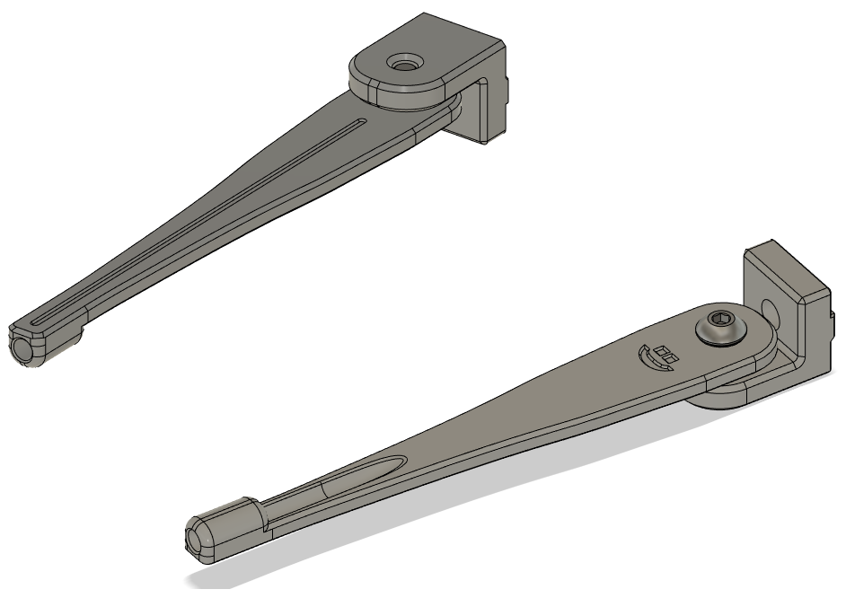
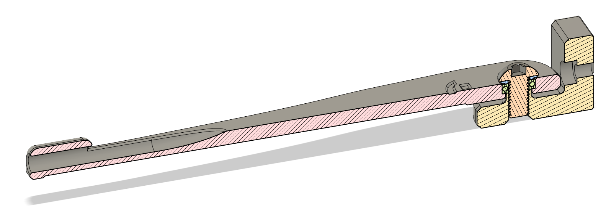

# CHANGELOG
- 29.11.2022: Initial release.

## Trident PTFE guide
##### Credits:
- GalvanicGlaze for sharing the CAD for his  ["PTFE bowden tube guide for Trident"](https://github.com/GalvanicGlaze/Voron_Mods/tree/main/Trident%20Bowden%20tube%20PTFE%20guide),.

###### Printing:
- Default voron settings, correct orientation, no supports needed!

###### Bom:
- 1x M3x8 Bolt and M3 T-nut
- 1x M3 T-nut
- 1x M5x10 BHCS
- 1x MR85 bearing

###### Description:
- Added a gearing at the pivot to make for smoother movement.
- Redid the PTFE path on the arm pluss widened the whole a little bit so the PTFE tube won't get squished.
- Added a flutes / design on the guide arm, mostly for looks (but it might help stiffen it a tiny bit too lol).

###### Pictures:

###### To-do List
- Nothing that i can think of.
