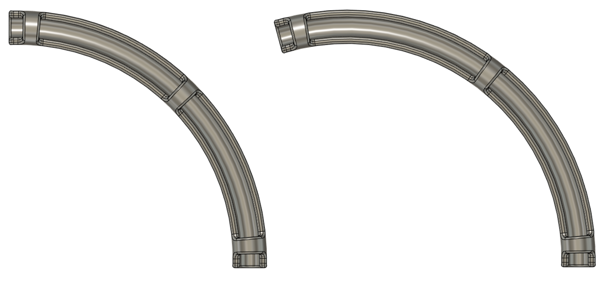
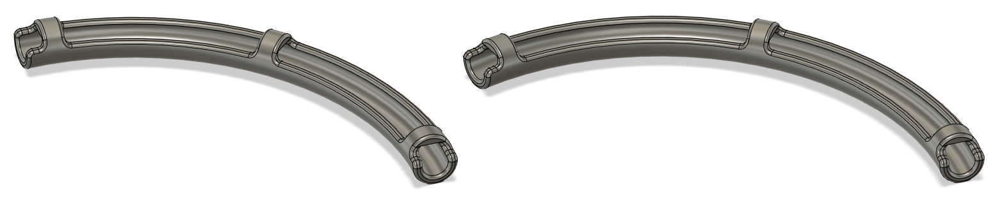
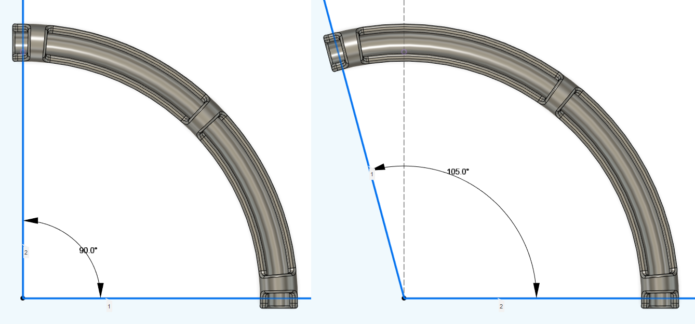

# Trident PTFE Guides
## CHANGELOG
- 23.09.2023: Added another set with 40mm radius as supposed to the first release that was 50mm. The two types are named `R40` & `R50` respectively.
- 01.12.2022: Initial release.

###### Printing:
- Default voron settings, correct orientation, no supports needed!

###### Bom:
- Only printed parts.

###### Description:
- Made to guide the PTFE tube uniformly into the extruder, and avoid rubbing against the top panel.
- One 90° version and one 105° version.
- The idea with the 105° is to point the PTFE tube slightly downwards so that it don't collide with the top side extrusions as badly, and / or bind up in them.

Note that this is intended to be used with an LGX Lite extruder, so i can't say if it will clear the top panel on a printer running a regular LGX, CW1 or CW2!

###### Pictures:

###### To-do List
- Nothing that i can think of.
