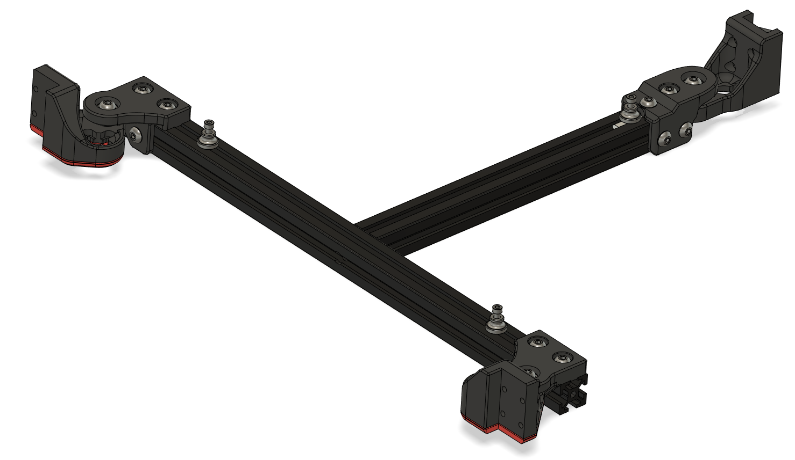

# 4mm extra Y travel

## CHANGELOG
- 29.04.2023: Initial release.

###### Description:
- These mounts are made to move the bed backwards 4mm in the "Y" direction/axis. The goal with this is to regain some of the "realestate" lost with using tap, while also getting enough headroom in FRONT of the bed to maybe fit a nozzle brush and purge bucket setup
- To compensate for the extra force (even though minimal) the front mounts have gotten one more screw mounting point. 
- The rear mount had to undergo some "weightloss" to get a comfy fit up against the bed (clearance), that meant remvoing some material, this has also been compensated for by adding a reinforcementand two extra screw mounts. This also called for support, so a built in support have been added.

###- Remember that you have to re-configure your axis limits,and your beds pivot points in regards to bed tramming/leveling with 4mm after doing this mod, or else you will have a bad time!

# !!Caution!!
## - This mod is meant to be used with TAP, and as a result of that the z-pin spot have now been occupied by the reinforcement of the rear mount!
## - To do this mod you will have to shorten down the backwards facing bed extrusion with 4mm!

###### Pictures:

###### Printing:
- Default voron settings, no additional supports needed (other than the build in ones)!

###### To-do List
- Make a better readme / instructions.