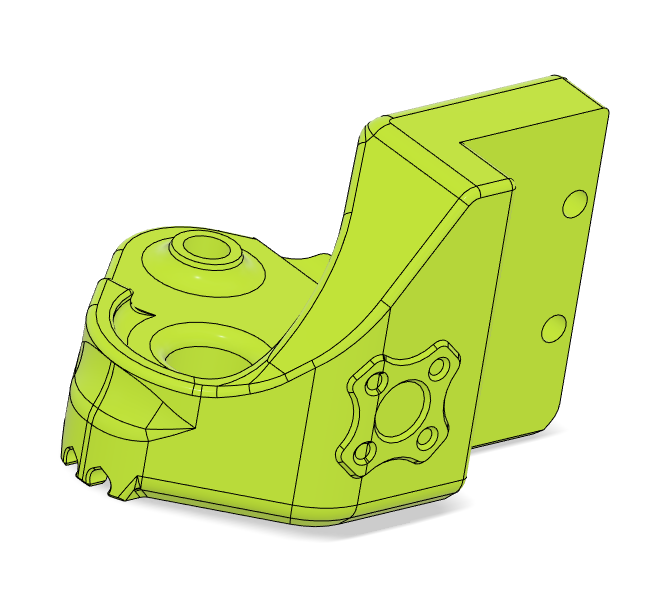
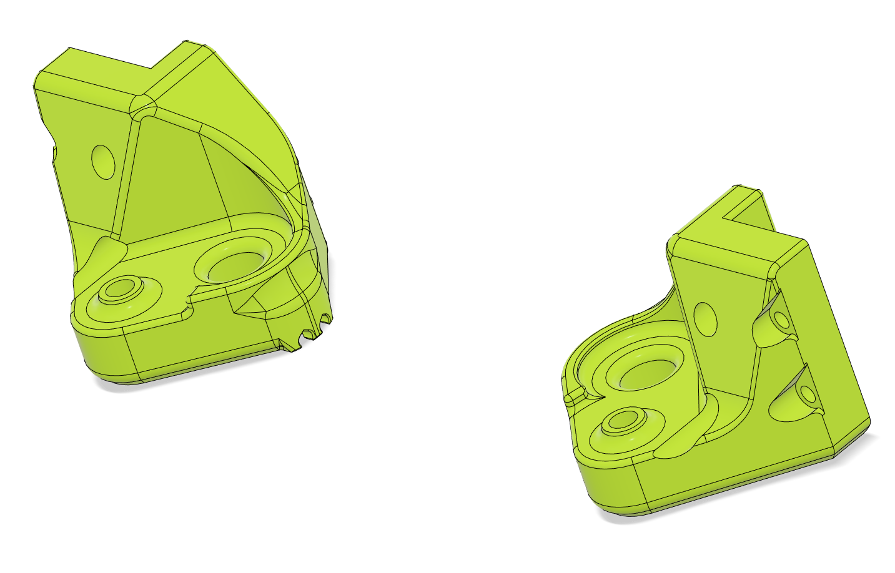
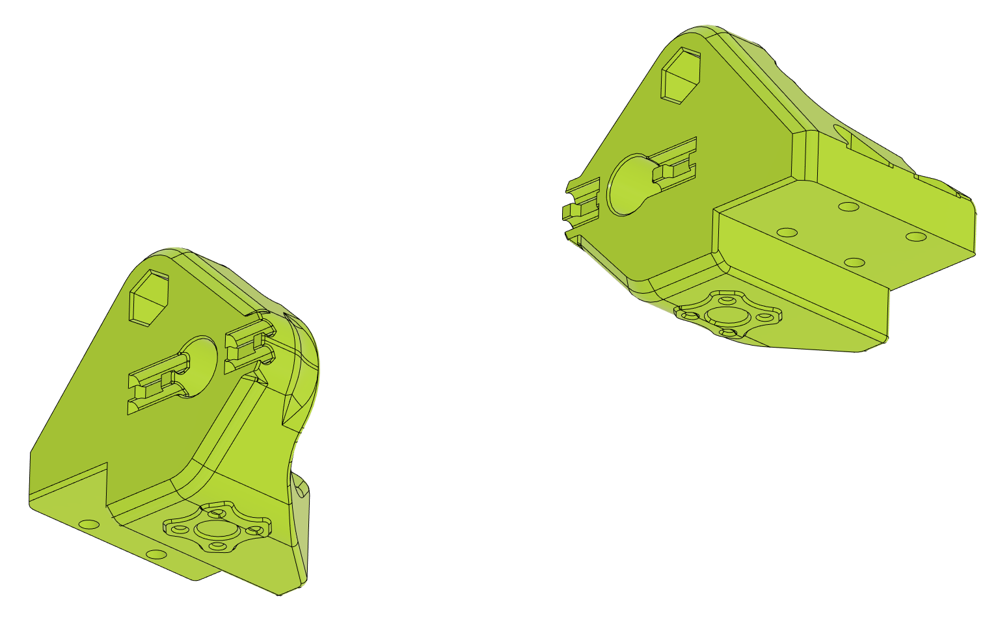
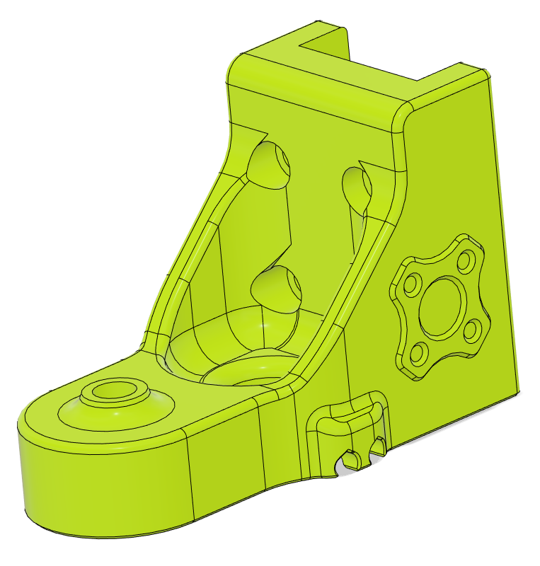
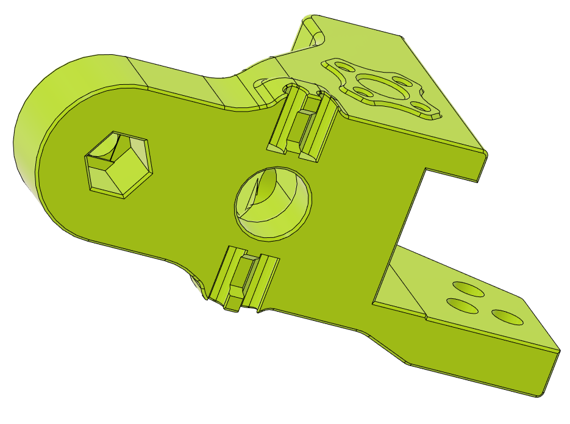
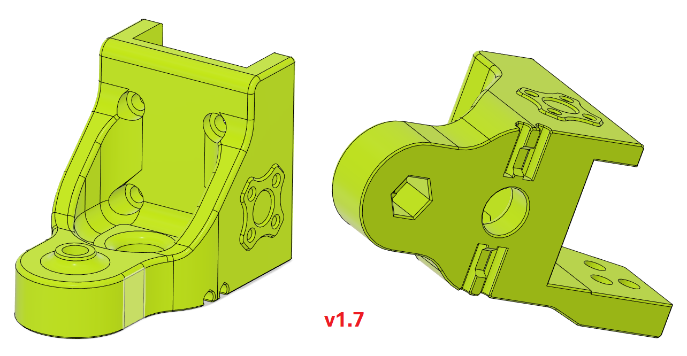
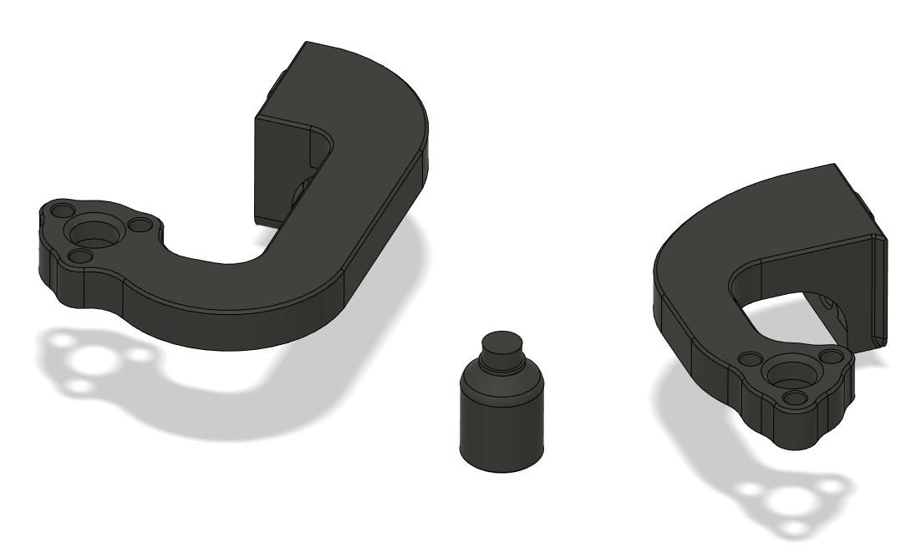

# Trident WobbleX carriers
## CHANGELOG
- 08.07.2023: Merged all my Wobblex mods into this one repo to make it easier (it was split into one repo for front, one for rear + one for rear-MGN12H before). This also brings the release of the leadscrew top supprts!
- 06.08.2023: Changed the Wobblex logo from an Emboss to a Deboss to better fit with the "Voron ethos", since all offical Voron logos are debossed rather than embossed.
- 01.05.2023: Opened up the center hole (where the leadscrew goes through) too 13mm to allow for more leadscrew movement wiithout interfering witht he carrier body.
- 25.04.2023: Variable pin sizes for WobbleX carriers, since it's been some issues with the pin sizes being either too small or large I've made a little test model so you can determine what suits you best. When you've found the right size for you then you choose the corresponding set of carriers & TR8 adapters.
- 23.04.2023: Initial release.
- 15.04.2023: WobbleX v1.7, resized the pin holes too 2.9mm (the old/stock was 3.1mm and the pins would be loose and fall out).
- 15.04.2023: WobbleX v1.6, added recess for the WobbleX balls (missing in stock/MGN9H release too).
- 11.04.2023: Counterbore fix for all carriages & WobbleX v1.5.
- 11.04.2023: WobbleX v1.

###### Printing:
- Default voron settings, correct orientation, no supports needed!

###### Bom:
- 3x WobbleX WS8 
- Stock Voron Trident screws etc.

###### Description:
- Since it's been a couple issues with the stock rear [WobbleX](https://github.com/MirageC79/Interfaces-for-WobbleX-integration/tree/main/Voron/Trident) Z carrier, which i have fixed for my MGN12H version i figured i could apply the same fixes to the MGN9H so that it's out there for those who need it. So here you go, enjoy!
- It's also been some issues with the pin sizes being either too small or large I've made a little test model so you can determine what suits you best. When you've found the right size for you then you choose the corresponding set of carriers & TR8 adapters.
- I've also made a set of Solid front carriers to use with your brand new Wobblex setup (if you don't mind printing more than "just" the adapter plate).
- Lastly I've also made a set of top supports for the leadscrews since they tend to flop around everywhere if they are bent (and i suspects thats the reason why you went with Wobblex in the first place. These use some tiny (and cheap) MR85 bearings you can get from the usual suspects.
if you have leadscrews that's got a 5mm "nubbin" at the top you should be able to use these supports without the bearing-leadscrew adapers since the MR85 bearings are have a 5mm ID.

You will loose a tiny bit of Z travel, otherwise it's not much to "negative" (quite substantial loss of Z travel with WobbleX, but that's not isolated to this mod, it's just the nature of the beast). 

For those who choose to run MGN12H in the rear i've also added a a modifed rail stop to fit the MGN12 rail!

###### Pictures:

10.5mm(old) vs 13mm(new)

The pin test block

The top supports

###### To-do List
- Nothing that i can think of.
